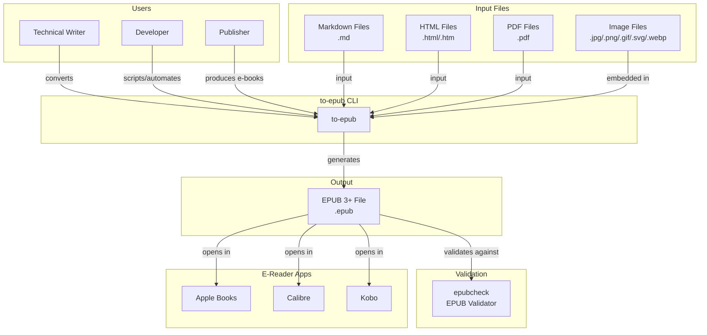
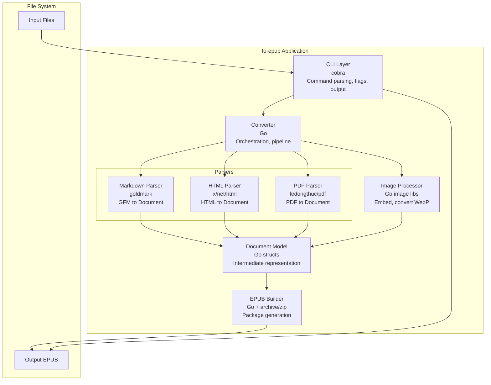
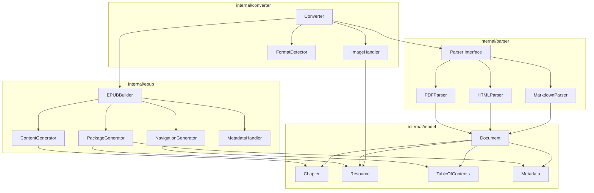
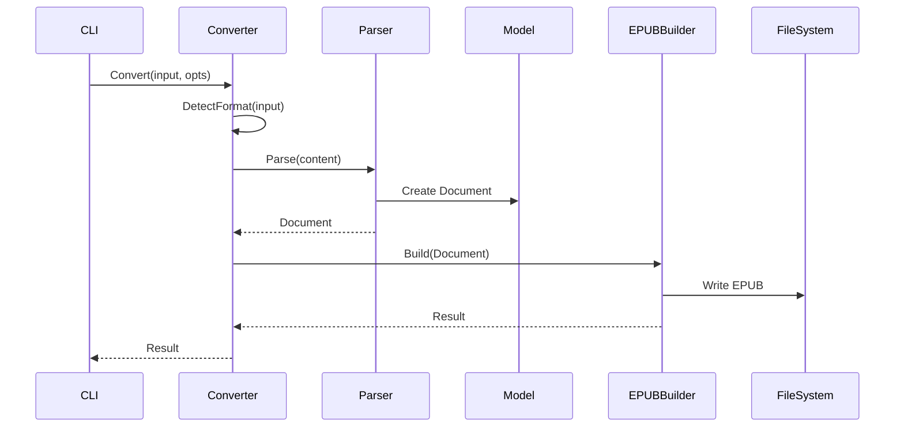
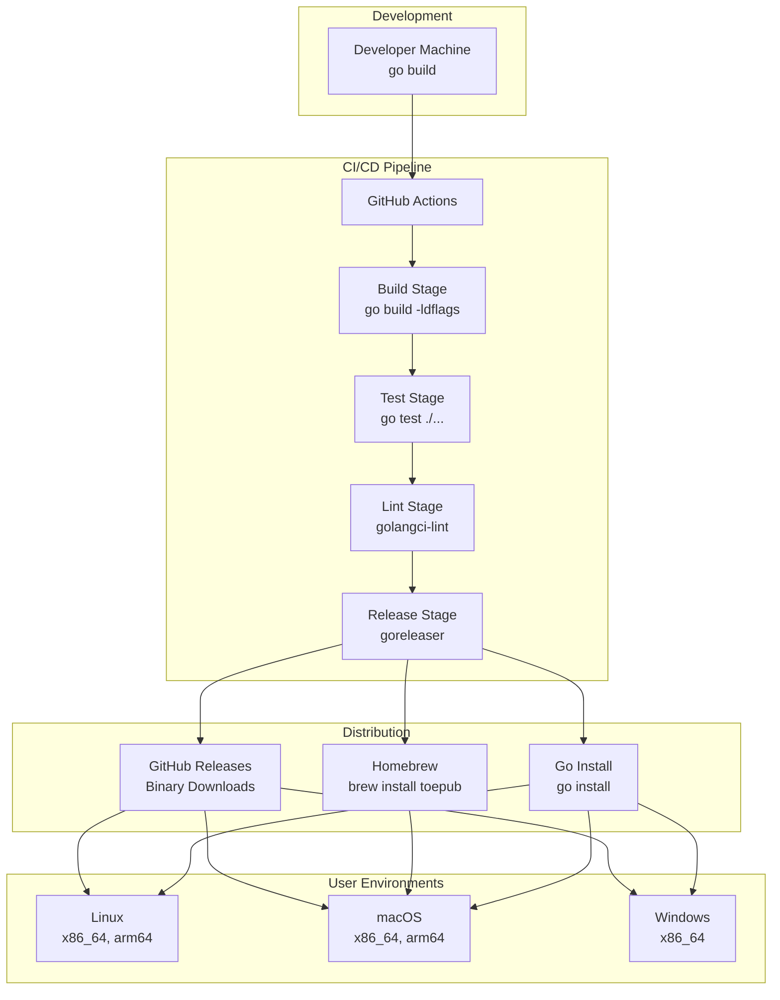

# Software Architecture Design: to-epub

**Version**: 1.0 | **Date**: 2025-12-15 | **Status**: Active
**Prepared by**: Development Team | **Reviewed by**: Technical Lead

---

## Document Control

| Version | Date | Author | Changes |
|---------|------|--------|---------|
| 1.0 | 2025-12-15 | Development Team | Initial architecture design |

**Related Documents**:

- Ground Rules: `memory/ground-rules.md`
- Feature Specifications: `specs/001-epub-converter-cli/spec.md`
- Implementation Plans: `specs/001-epub-converter-cli/design.md`
- Coding Standards: `docs/standards.md`

---

## Executive Summary

**Purpose**: to-epub is a command-line tool that converts Markdown, HTML, and PDF documents into valid EPUB 3+ e-book files. It enables technical writers, publishers, and developers to transform their content into professionally formatted e-books compatible with all major e-reader devices.

**Scope**: This architecture covers the CLI application, input format parsers, EPUB generation pipeline, and output validation. It excludes GUI interfaces, cloud deployment, and OCR capabilities for scanned PDFs.

**Key Architectural Decisions**:

- **Modular Monolith**: Single binary with cleanly separated internal packages for maintainability
- **Pipeline Architecture**: Parser → Document Model → EPUB Builder flow for consistent processing
- **Interface-Driven Design**: Parser interface enables easy addition of new input formats
- **Standards-First Output**: All output validated against EPUB 3.3 specification via epubcheck

**Target Audience**: Developers implementing the tool, maintainers extending functionality, and technical leads reviewing the design.

---

## Table of Contents

1. [Introduction](#1-introduction)
2. [Architectural Drivers](#2-architectural-drivers)
3. [System Context View](#3-system-context-view)
4. [Container View](#4-container-view)
5. [Component View](#5-component-view)
6. [Code View](#6-code-view)
7. [Deployment View](#7-deployment-view)
8. [Architecture Decisions](#8-architecture-decisions)
9. [Quality Attributes](#9-quality-attributes)
10. [Risks & Technical Debt](#10-risks--technical-debt)
11. [Appendices](#11-appendices)

---

## 1. Introduction

### 1.1 Purpose

This document describes the software architecture for the to-epub CLI tool. It provides a comprehensive view of the system's structure, components, and design decisions to guide development teams and ensure consistent implementation across all features.

### 1.2 Scope

**In Scope**:

- CLI application entry point and command handling
- Input format parsers (Markdown, HTML, PDF)
- Intermediate document representation
- EPUB 3+ package generation
- Image processing and embedding
- Metadata handling and validation

**Out of Scope**:

- Graphical user interface (GUI)
- Cloud/web service deployment
- OCR for scanned/image-based PDFs
- Real-time collaborative editing
- EPUB reading/rendering capabilities

### 1.3 Architectural Approach

This architecture follows a **modular monolith pattern** with a **pipeline-based processing model**. The single binary design simplifies distribution while internal package boundaries maintain separation of concerns.

**Key Principles** (from ground-rules.md):

1. **EPUB 3+ Standards Compliance**: All output must pass epubcheck validation
2. **CLI-First Design**: Full functionality via command-line with Unix composability
3. **Input Format Fidelity**: Preserve semantic meaning during conversion
4. **Maintainability-First Architecture**: Single responsibility, clear interfaces
5. **Test-Driven Quality**: Comprehensive automated testing at all levels

### 1.4 Definitions, Acronyms, and Abbreviations

| Term | Definition |
|------|------------|
| EPUB | Electronic Publication - standard e-book format |
| GFM | GitHub Flavored Markdown |
| OPF | Open Packaging Format - EPUB metadata file |
| XHTML | Extensible HyperText Markup Language |
| TOC | Table of Contents |
| NAV | Navigation Document (nav.xhtml in EPUB 3) |
| CLI | Command Line Interface |
| Dublin Core | Metadata standard used in EPUB |

---

## 2. Architectural Drivers

### 2.1 Stakeholders and Concerns

| Stakeholder | Role | Key Concerns |
|-------------|------|--------------|
| Technical Writers | Primary users | Output quality, format fidelity, ease of use |
| Developers | Script/pipeline integration | JSON output, exit codes, stdin support |
| Publishers | Professional e-book production | Metadata accuracy, e-reader compatibility |
| Maintainers | Code maintenance | Modularity, testability, extensibility |
| Operations | Distribution | Single binary, cross-platform support |

### 2.2 Business Goals

1. **BG-001**: Enable conversion of common document formats to EPUB with minimal configuration
2. **BG-002**: Produce e-books compatible with all major e-reader devices (Apple Books, Calibre, Kobo, Kindle)
3. **BG-003**: Support automation and integration into publishing workflows via CLI
4. **BG-004**: Allow extension to new input formats without architectural changes

### 2.3 Quality Attribute Requirements

#### 2.3.1 Performance

- **PE-001**: Convert 50-page Markdown document to EPUB in under 5 seconds
- **PE-002**: Convert 50-page HTML document to EPUB in under 5 seconds
- **PE-003**: Convert 50-page text-based PDF to EPUB in under 30 seconds
- **PE-004**: Process files up to 100MB without excessive memory usage (<100MB RAM)

#### 2.3.2 Reliability

- **RE-001**: 100% of generated EPUB files MUST pass epubcheck validation
- **RE-002**: Partial failures MUST NOT produce corrupt output files
- **RE-003**: All errors MUST produce actionable messages on stderr

#### 2.3.3 Usability

- **US-001**: Users can successfully convert a file within 2 minutes of first use
- **US-002**: --help provides complete documentation with examples
- **US-003**: Exit codes follow Unix conventions for scriptability

#### 2.3.4 Maintainability

- **MA-001**: New input format can be added without modifying existing parsers
- **MA-002**: Code coverage exceeds 80% for parser and EPUB modules
- **MA-003**: All packages have clear interfaces with no circular dependencies

#### 2.3.5 Portability

- **PO-001**: Single binary runs on Linux, macOS, and Windows without dependencies
- **PO-002**: Cross-compilation supported for all target platforms

### 2.4 Constraints

**Technical Constraints**:

- **TC-001**: Implementation in Go 1.24+ for single-binary distribution
- **TC-002**: No runtime dependencies (statically linked binary)
- **TC-003**: EPUB output must conform to EPUB 3.3 specification
- **TC-004**: Use goldmark for GFM-compliant Markdown parsing

**Organizational Constraints**:

- **OC-001**: Open source libraries preferred for all dependencies
- **OC-002**: Test suite must run in CI on every commit

### 2.5 Assumptions and Dependencies

**Assumptions**:

- **AS-001**: Input Markdown follows GitHub Flavored Markdown specification
- **AS-002**: Input HTML is well-formed or parseable by standard HTML parsers
- **AS-003**: PDF text extraction works only on text-based PDFs (not scanned images)
- **AS-004**: Users have write permissions to output directory

**Dependencies**:

- **DE-001**: goldmark - GFM-compliant Markdown parser
- **DE-002**: golang.org/x/net/html - HTML parser
- **DE-003**: ledongthuc/pdf + pdfcpu - PDF text and image extraction
- **DE-004**: cobra - CLI framework
- **DE-005**: golang.org/x/image/webp - WebP image decoding

---

## 3. System Context View

### 3.1 Context Diagram



### 3.2 Context Description

**System**: to-epub CLI

The to-epub CLI is a standalone command-line application that converts document files (Markdown, HTML, PDF) into EPUB 3+ e-book format. It processes input files, extracts content and structure, embeds referenced images, and packages everything into a standards-compliant EPUB file.

**Users and External Systems**:

| Actor/System | Type | Description | Interaction |
|--------------|------|-------------|-------------|
| Technical Writer | User | Authors converting documentation to e-books | Interactive CLI usage, single conversions |
| Developer | User | Automation engineers integrating into pipelines | Scripted usage, JSON output, exit codes |
| Publisher | User | Professional e-book producers | Batch conversions, metadata control |
| Markdown Files | Input | GFM-formatted text documents | Parsed for content, headings, images |
| HTML Files | Input | Web content with optional CSS | Converted to XHTML, styles preserved |
| PDF Files | Input | Text-based PDF documents | Text/images extracted, structure inferred |
| EPUB File | Output | Standards-compliant e-book | Generated with full metadata and navigation |
| epubcheck | Validation | W3C EPUB validation tool | Validates output compliance |
| E-Reader Apps | Consumer | End-user reading applications | Display generated EPUB files |

### 3.3 System Responsibilities

**What the system does**:

- Parses Markdown, HTML, and PDF input files
- Extracts document structure (headings, paragraphs, lists, tables)
- Embeds and converts images to EPUB-compatible formats
- Generates navigable table of contents from heading structure
- Produces EPUB 3+ package with valid metadata
- Provides CLI interface with comprehensive options
- Outputs human-readable or JSON-formatted results

**What the system does NOT do**:

- OCR for scanned/image-based PDFs
- GUI-based editing or preview
- Cloud storage or synchronization
- EPUB reading or rendering
- Real-time collaborative editing
- Format conversion beyond EPUB (e.g., MOBI, AZW)

---

## 4. Container View

### 4.1 Container Diagram



### 4.2 Container Descriptions

#### Container 1: CLI Layer

- **Technology**: Go 1.24+, cobra CLI framework
- **Purpose**: Entry point handling command-line interaction
- **Responsibilities**:
  - Parse command-line arguments and flags
  - Validate input paths and options
  - Route to converter with configuration
  - Format and display output (human/JSON)
  - Return appropriate exit codes
- **Key Files**: `cmd/toepub/main.go`, `internal/cli/`

#### Container 2: Converter

- **Technology**: Go 1.24+
- **Purpose**: Orchestrates the conversion pipeline
- **Responsibilities**:
  - Detect input format from file extension
  - Select and invoke appropriate parser
  - Coordinate image processing
  - Pass document model to EPUB builder
  - Collect warnings and statistics
- **Key Files**: `internal/converter/converter.go`

#### Container 3: Parsers (Markdown, HTML, PDF)

- **Technology**: goldmark (MD), x/net/html (HTML), ledongthuc/pdf (PDF)
- **Purpose**: Transform input formats to intermediate representation
- **Responsibilities**:
  - Parse input content into structured form
  - Extract headings for TOC generation
  - Identify and resolve image references
  - Extract metadata (front matter, meta tags)
  - Handle format-specific features (GFM tables, CSS, etc.)
- **Key Files**: `internal/parser/markdown.go`, `html.go`, `pdf.go`

#### Container 4: Document Model

- **Technology**: Go structs
- **Purpose**: Format-agnostic intermediate representation
- **Responsibilities**:
  - Store document content as chapters
  - Hold metadata (title, author, language)
  - Track resources (images, stylesheets)
  - Maintain TOC structure
- **Key Files**: `internal/model/document.go`, `metadata.go`, `toc.go`

#### Container 5: Image Processor

- **Technology**: Go image packages, x/image/webp
- **Purpose**: Handle image embedding and conversion
- **Responsibilities**:
  - Read images from file paths
  - Convert WebP to PNG for EPUB compatibility
  - Validate supported image formats
  - Generate warnings for unsupported formats
- **Key Files**: `internal/converter/image.go`

#### Container 6: EPUB Builder

- **Technology**: Go, archive/zip, text/template
- **Purpose**: Generate valid EPUB 3+ package
- **Responsibilities**:
  - Create EPUB container structure
  - Generate content.opf (package document)
  - Generate nav.xhtml (navigation document)
  - Convert content to XHTML5
  - Package into ZIP with proper MIME type
- **Key Files**: `internal/epub/builder.go`, `content.go`, `navigation.go`, `package.go`

### 4.3 Inter-Container Communication

| From | To | Method | Purpose | Data |
|------|-------|--------|---------|------|
| CLI | Converter | Function call | Initiate conversion | Options struct |
| Converter | Parser | Interface call | Parse input | File path/content |
| Parser | Model | Struct creation | Store parsed data | Document struct |
| Converter | Image Processor | Function call | Process images | Image paths |
| Image Processor | Model | Struct update | Add resources | Resource structs |
| Converter | EPUB Builder | Function call | Generate output | Document model |
| EPUB Builder | File System | File write | Save EPUB | ZIP bytes |
| CLI | stdout/stderr | I/O | Display results | Text/JSON |

---

## 5. Component View

### 5.1 Converter Component Diagram



### 5.2 Component Descriptions

#### Component Group: Converter (internal/converter)

##### Converter

- **Purpose**: Main orchestration component for conversion pipeline
- **Responsibilities**:
  - Accept input path and options
  - Detect format and select parser
  - Execute conversion pipeline
  - Return result with statistics
- **Interface**:
  - `Convert(input string, opts Options) (*Result, error)`
  - `ConvertMultiple(inputs []string, opts Options) (*Result, error)`

##### ImageHandler

- **Purpose**: Process and convert images for EPUB embedding
- **Responsibilities**:
  - Read image files from disk
  - Convert WebP to PNG
  - Validate image formats
  - Generate warnings for unsupported formats
- **Interface**:
  - `ProcessImage(path string) (*Resource, error)`
  - `ConvertWebP(data []byte) ([]byte, error)`

##### FormatDetector

- **Purpose**: Detect input format from file extension or content
- **Responsibilities**:
  - Map file extensions to formats
  - Provide override via explicit format flag
- **Interface**:
  - `Detect(path string) (Format, error)`
  - `DetectFromContent(content []byte) (Format, error)`

#### Component Group: Parser (internal/parser)

##### Parser Interface

```go
type Parser interface {
    Parse(content []byte) (*Document, error)
    SupportedExtensions() []string
}
```

##### MarkdownParser

- **Purpose**: Parse GFM Markdown to Document model
- **Responsibilities**:
  - Parse Markdown using goldmark with GFM extension
  - Extract YAML front matter for metadata
  - Identify heading structure for TOC
  - Resolve relative image paths
- **Dependencies**: goldmark, goldmark-meta

##### HTMLParser

- **Purpose**: Parse HTML to Document model
- **Responsibilities**:
  - Parse HTML using x/net/html
  - Extract meta tags for metadata
  - Preserve semantic structure
  - Handle inline and linked CSS
  - Download remote images if needed
- **Dependencies**: golang.org/x/net/html

##### PDFParser

- **Purpose**: Extract text and images from PDF to Document model
- **Responsibilities**:
  - Extract text with layout awareness
  - Detect heading structure from font sizes
  - Extract embedded images
  - Return error for image-based PDFs
- **Dependencies**: ledongthuc/pdf, pdfcpu

#### Component Group: EPUB (internal/epub)

##### EPUBBuilder

- **Purpose**: Coordinate EPUB package generation
- **Responsibilities**:
  - Create EPUB container structure
  - Invoke content, navigation, and package generators
  - Write final ZIP file with proper MIME type
- **Interface**:
  - `Build(doc *Document) ([]byte, error)`
  - `WriteToFile(doc *Document, path string) error`

##### ContentGenerator

- **Purpose**: Generate XHTML content documents
- **Responsibilities**:
  - Convert chapters to valid XHTML5
  - Apply EPUB 3 semantic attributes (epub:type)
  - Embed inline styles
- **Interface**:
  - `Generate(chapter *Chapter) (string, error)`

##### NavigationGenerator

- **Purpose**: Generate nav.xhtml navigation document
- **Responsibilities**:
  - Create TOC navigation from heading structure
  - Generate landmarks (cover, toc, bodymatter)
  - Follow EPUB 3 navigation specification
- **Interface**:
  - `Generate(toc *TableOfContents) (string, error)`

##### PackageGenerator

- **Purpose**: Generate content.opf package document
- **Responsibilities**:
  - Generate Dublin Core metadata
  - Create manifest listing all resources
  - Create spine with reading order
- **Interface**:
  - `Generate(doc *Document) (string, error)`

##### MetadataHandler

- **Purpose**: Handle EPUB metadata (Dublin Core)
- **Responsibilities**:
  - Merge source metadata with CLI overrides
  - Generate unique identifier (UUID)
  - Validate required metadata fields
- **Interface**:
  - `Merge(source, cli *Metadata) *Metadata`
  - `Validate(meta *Metadata) error`

### 5.3 Component Interaction Patterns

**Pattern 1: Pipeline Processing**



**Pattern 2: Interface-Based Parser Selection**

- Converter holds reference to Parser interface
- Concrete parsers (Markdown, HTML, PDF) implement interface
- Format detection selects appropriate parser at runtime
- New formats added by implementing Parser interface

**Pattern 3: Intermediate Document Model**

- All parsers produce same Document structure
- EPUB Builder consumes Document without knowing source format
- Enables consistent output regardless of input format

---

## 6. Code View

### 6.1 Code Organization

```text
to-epub/
├── cmd/
│   └── toepub/
│       └── main.go                 # Entry point
├── internal/
│   ├── cli/
│   │   ├── root.go                 # Root command
│   │   ├── convert.go              # Convert command
│   │   ├── version.go              # Version command
│   │   └── output.go               # Output formatting
│   ├── parser/
│   │   ├── parser.go               # Parser interface
│   │   ├── markdown.go             # Markdown parser
│   │   ├── markdown_test.go
│   │   ├── html.go                 # HTML parser
│   │   ├── html_test.go
│   │   ├── pdf.go                  # PDF parser
│   │   └── pdf_test.go
│   ├── epub/
│   │   ├── builder.go              # EPUB builder
│   │   ├── builder_test.go
│   │   ├── content.go              # XHTML content
│   │   ├── navigation.go           # nav.xhtml
│   │   ├── package.go              # content.opf
│   │   ├── metadata.go             # Dublin Core
│   │   └── templates/              # EPUB templates
│   │       ├── content.xhtml.tmpl
│   │       ├── nav.xhtml.tmpl
│   │       └── package.opf.tmpl
│   ├── converter/
│   │   ├── converter.go            # Orchestration
│   │   ├── converter_test.go
│   │   ├── image.go                # Image handling
│   │   └── image_test.go
│   └── model/
│       ├── document.go             # Document struct
│       ├── chapter.go              # Chapter struct
│       ├── resource.go             # Resource struct
│       ├── toc.go                  # TOC struct
│       └── metadata.go             # Metadata struct
├── tests/
│   ├── fixtures/
│   │   ├── markdown/
│   │   ├── html/
│   │   └── pdf/
│   └── golden/
│       └── expected_output/
├── docs/
│   ├── architecture.md             # This document
│   ├── standards.md                # Coding standards
│   └── standards-cheatsheet.md
├── specs/
│   └── 001-epub-converter-cli/
├── memory/
│   └── ground-rules.md
├── go.mod
├── go.sum
├── Makefile
├── README.md
└── CLAUDE.md
```

### 6.2 Naming Conventions

See `docs/standards.md` for complete naming conventions. Key points:

- **Packages**: lowercase, singular (parser, epub, model)
- **Exported**: PascalCase (Document, Parser, Build)
- **Unexported**: camelCase (parseHeadings, buildNav)
- **Interfaces**: -er suffix (Parser, Builder, Validator)
- **Errors**: Err prefix (ErrFileNotFound, ErrInvalidFormat)

### 6.3 Key Design Patterns

| Pattern | Purpose | Usage |
|---------|---------|-------|
| Interface | Abstraction | Parser interface for format flexibility |
| Pipeline | Processing | Input → Parse → Model → Build → Output |
| Template Method | EPUB generation | Base builder with customizable parts |
| Factory | Parser selection | FormatDetector creates appropriate parser |
| Visitor | TOC generation | Walk document tree for heading extraction |

---

## 7. Deployment View

### 7.1 Deployment Architecture



### 7.2 Build and Distribution

#### Build Process

```bash
# Development build
go build -o toepub ./cmd/toepub

# Release build with version info
go build -ldflags "-X main.version=1.0.0 -X main.buildDate=$(date -u +%Y-%m-%d)" \
    -o toepub ./cmd/toepub

# Cross-compilation
GOOS=linux GOARCH=amd64 go build -o toepub-linux-amd64 ./cmd/toepub
GOOS=darwin GOARCH=arm64 go build -o toepub-darwin-arm64 ./cmd/toepub
GOOS=windows GOARCH=amd64 go build -o toepub-windows-amd64.exe ./cmd/toepub
```

#### Distribution Channels

| Channel | Command | Platforms |
|---------|---------|-----------|
| GitHub Releases | Download binary | All |
| Homebrew | `brew install toepub` | macOS |
| Go Install | `go install github.com/dauquangthanh/epub-converter@latest` | All |

### 7.3 CI/CD Pipeline

```yaml
# .github/workflows/ci.yml
name: CI

on: [push, pull_request]

jobs:
  test:
    runs-on: ubuntu-latest
    steps:
      - uses: actions/checkout@v4
      - uses: actions/setup-go@v5
        with:
          go-version: '1.24'
      - run: go test -race -coverprofile=coverage.out ./...
      - run: go tool cover -func=coverage.out

  lint:
    runs-on: ubuntu-latest
    steps:
      - uses: actions/checkout@v4
      - uses: golangci/golangci-lint-action@v3

  build:
    runs-on: ubuntu-latest
    strategy:
      matrix:
        goos: [linux, darwin, windows]
        goarch: [amd64, arm64]
    steps:
      - uses: actions/checkout@v4
      - uses: actions/setup-go@v5
      - run: GOOS=${{ matrix.goos }} GOARCH=${{ matrix.goarch }} go build ./cmd/toepub

  release:
    needs: [test, lint, build]
    if: startsWith(github.ref, 'refs/tags/')
    runs-on: ubuntu-latest
    steps:
      - uses: actions/checkout@v4
      - uses: goreleaser/goreleaser-action@v5
```

### 7.4 Installation

```bash
# From source
git clone https://github.com/dauquangthanh/epub-converter
cd toepub
go build -o toepub ./cmd/toepub
sudo mv toepub /usr/local/bin/

# Using go install
go install github.com/dauquangthanh/epub-converter/cmd/toepub@latest

# Using Homebrew (macOS)
brew install toepub

# Download pre-built binary
curl -L https://github.com/dauquangthanh/epub-converter/releases/latest/download/toepub-$(uname -s)-$(uname -m).tar.gz | tar xz
sudo mv toepub /usr/local/bin/
```

---

## 8. Architecture Decisions

### 8.1 Decision Log

| ID | Date | Title | Status |
|----|------|-------|--------|
| ADR-001 | 2025-12-15 | Use Modular Monolith Architecture | Accepted |
| ADR-002 | 2025-12-15 | Custom EPUB Generation vs Library | Accepted |
| ADR-003 | 2025-12-15 | goldmark for Markdown Parsing | Accepted |
| ADR-004 | 2025-12-15 | Interface-Based Parser Design | Accepted |
| ADR-005 | 2025-12-15 | Intermediate Document Model | Accepted |

### 8.2 Architecture Decision Records

#### ADR-001: Use Modular Monolith Architecture

**Date**: 2025-12-15
**Status**: Accepted
**Deciders**: Development Team

**Context**:
Need to choose between microservices, modular monolith, or simple monolith for a CLI tool that converts documents to EPUB. The tool has multiple input formats (Markdown, HTML, PDF) and a single output format (EPUB).

**Decision**:
Adopt a modular monolith architecture with clear package boundaries within a single Go binary.

**Rationale**:

- CLI tools benefit from single-binary distribution (no runtime dependencies)
- Go's package system provides natural module boundaries
- No network communication overhead between components
- Simpler testing and debugging than distributed systems

**Consequences**:

*Positive*:

- Single binary simplifies distribution and installation
- No service discovery, network timeouts, or partial failures
- Fast inter-component communication via function calls
- Easy to test end-to-end locally

*Negative*:

- Cannot scale components independently (not needed for CLI)
- All code compiled into single binary (acceptable size for this use case)

**Alternatives Considered**:

1. **Microservices**: Separate services for each parser
   - Pros: Independent scaling, language flexibility per service
   - Cons: Massive overkill for CLI tool, complex deployment
   - Why rejected: CLI tools don't need independent scaling

2. **Simple Monolith**: No internal structure
   - Pros: Simpler initial development
   - Cons: Hard to maintain, test, and extend
   - Why rejected: Violates maintainability principle

---

#### ADR-002: Custom EPUB Generation vs Library

**Date**: 2025-12-15
**Status**: Accepted
**Deciders**: Development Team

**Context**:
Need to decide whether to use an existing Go EPUB library or build custom EPUB generation. Research found no mature Go EPUB 3 libraries with active maintenance.

**Decision**:
Build custom EPUB generation using Go's archive/zip and text/template packages.

**Rationale**:

- No mature Go EPUB 3 libraries available (research documented in specs/001-epub-converter-cli/research.md)
- EPUB is essentially a ZIP file with specific structure
- Full control over EPUB 3.3 compliance
- Can generate exactly the output structure needed

**Consequences**:

*Positive*:

- Full control over EPUB output
- No dependency on unmaintained libraries
- Can ensure EPUB 3.3 compliance
- Easier to debug and fix issues

*Negative*:

- More initial development work
- Must implement EPUB spec details ourselves
- Need to keep up with EPUB spec changes

**Alternatives Considered**:

1. **go-epub library**: Existing Go EPUB library
   - Pros: Ready-made solution
   - Cons: Targets EPUB 2, not actively maintained, limited customization
   - Why rejected: Doesn't meet EPUB 3+ requirement

---

#### ADR-003: goldmark for Markdown Parsing

**Date**: 2025-12-15
**Status**: Accepted
**Deciders**: Development Team

**Context**:
Need a Markdown parser that supports GitHub Flavored Markdown (GFM) including tables, task lists, strikethrough, and autolinks.

**Decision**:
Use goldmark with GFM extension for Markdown parsing.

**Rationale**:

- Only GFM-compliant Go parser with active maintenance
- Extensible architecture for custom extensions
- Produces clean AST for transformation
- Well-documented and widely used

**Consequences**:

*Positive*:

- Full GFM support out of the box
- Active development and community
- Good performance
- Extensible for future needs

*Negative*:

- Learning curve for custom extensions
- Must use goldmark's AST walking pattern

**Alternatives Considered**:

1. **blackfriday**: Popular Go Markdown parser
   - Pros: Simple API, fast
   - Cons: Limited GFM support, deprecated
   - Why rejected: Doesn't fully support GFM

2. **gomarkdown**: Fork of blackfriday
   - Pros: More features than blackfriday
   - Cons: Inconsistent GFM support
   - Why rejected: GFM compliance issues

---

#### ADR-004: Interface-Based Parser Design

**Date**: 2025-12-15
**Status**: Accepted
**Deciders**: Development Team

**Context**:
Need to support multiple input formats (Markdown, HTML, PDF) with potential for adding more in the future.

**Decision**:
Define a Parser interface that all format parsers implement, enabling runtime selection and future extension.

**Rationale**:

- Follows Go's interface-based design idiom
- Enables adding new formats without changing existing code
- Converter doesn't need to know about specific formats
- Easy to test with mock parsers

**Consequences**:

*Positive*:

- New formats added by implementing interface
- Loose coupling between converter and parsers
- Easy to unit test converter with mock parsers
- Clean separation of concerns

*Negative*:

- Slightly more indirection than direct calls
- Interface may need revision for format-specific features

---

#### ADR-005: Intermediate Document Model

**Date**: 2025-12-15
**Status**: Accepted
**Deciders**: Development Team

**Context**:
Parsers produce different output structures, but EPUB builder needs consistent input. Need to decide how to bridge this gap.

**Decision**:
Define a format-agnostic Document model as intermediate representation between parsers and EPUB builder.

**Rationale**:

- Decouples parsers from EPUB generation
- Single model for EPUB builder regardless of source format
- Can validate and enrich document before EPUB generation
- Enables future output formats (if needed)

**Consequences**:

*Positive*:

- Clean separation between parsing and generation
- Single point of validation
- EPUB builder is simpler (one input type)
- Future output formats could reuse Document model

*Negative*:

- Some format-specific information may be lost
- Extra transformation step from parser output to Document

---

## 9. Quality Attributes

### 9.1 Performance Strategies

**Strategy 1: Streaming Processing**

- **Implementation**: Process large files in chunks rather than loading entirely into memory
- **Target**: Handle files up to 100MB with <100MB RAM usage
- **Components**: All parsers, image processor

**Strategy 2: Efficient Image Handling**

- **Implementation**: Process images only once, cache converted images
- **Target**: Avoid redundant WebP→PNG conversions for repeated images
- **Components**: ImageHandler

**Strategy 3: Lazy Loading**

- **Implementation**: Load and parse files only when needed
- **Target**: Fast startup, minimal resource usage for help/version commands
- **Components**: CLI layer

### 9.2 Reliability Strategies

**Strategy 1: Validation at Every Stage**

- **Implementation**: Validate input, intermediate model, and output
- **Target**: Catch errors early, never produce invalid EPUB
- **Components**: All parsers, Document model, EPUB builder

**Strategy 2: Atomic File Operations**

- **Implementation**: Write to temp file, then rename to target
- **Target**: Never leave partial/corrupt output files
- **Components**: EPUB builder

**Strategy 3: Comprehensive Error Handling**

- **Implementation**: Wrap all errors with context, provide actionable messages
- **Target**: Users can understand and fix issues without debugging
- **Components**: All

### 9.3 Maintainability Strategies

**Strategy 1: Interface-Based Design**

- **Implementation**: Parser interface, builder interface
- **Target**: Add new formats without modifying existing code
- **Components**: Parser package, EPUB package

**Strategy 2: Comprehensive Testing**

- **Implementation**: Unit tests (>80% coverage), integration tests, contract tests (epubcheck)
- **Target**: Confident refactoring, catch regressions
- **Components**: All

**Strategy 3: Clear Package Boundaries**

- **Implementation**: internal/ packages, no circular dependencies
- **Target**: Easy to understand, modify, and test in isolation
- **Components**: All

### 9.4 Usability Strategies

**Strategy 1: Self-Documenting CLI**

- **Implementation**: cobra's built-in help, examples in --help output
- **Target**: Users productive within 2 minutes
- **Components**: CLI layer

**Strategy 2: Sensible Defaults**

- **Implementation**: Auto-detect format, default output path, UTF-8 encoding
- **Target**: Simple commands for common cases
- **Components**: CLI layer, converter

**Strategy 3: Dual Output Formats**

- **Implementation**: Human-readable (default) and JSON (--format json)
- **Target**: Both interactive users and automation
- **Components**: CLI output module

---

## 10. Risks & Technical Debt

### 10.1 Architecture Risks

| Risk ID | Description | Impact | Probability | Mitigation Strategy |
|---------|-------------|--------|-------------|---------------------|
| AR-001 | PDF parsing quality varies by document | Medium | High | Provide clear error messages, document limitations |
| AR-002 | EPUB spec changes require updates | Low | Low | Monitor W3C EPUB updates, design for change |
| AR-003 | goldmark breaking changes | Medium | Low | Pin dependency versions, test on upgrade |
| AR-004 | Memory exhaustion on very large files | Medium | Medium | Implement streaming, set size limits |

### 10.2 Known Technical Debt

| Debt ID | Description | Impact | Effort | Priority | Plan |
|---------|-------------|--------|--------|----------|------|
| TD-001 | No OCR support for scanned PDFs | Medium | High | P3 | Document limitation, suggest external OCR tools |
| TD-002 | CSS handling in HTML conversion is basic | Low | Medium | P3 | Enhance CSS preservation in future version |
| TD-003 | No progress reporting for long conversions | Low | Low | P2 | Add progress callback in converter |

### 10.3 Open Questions & Future Considerations

**Open Questions**:

1. Should we support EPUB 2 output as a compatibility option?
   - Status: Deferred
   - Rationale: Focus on EPUB 3+ per ground-rules

2. Should we integrate OCR for scanned PDFs?
   - Status: Deferred to future version
   - Rationale: Significant complexity, external tools available

**Future Enhancements**:

- **Multi-language support**: Detect and set language metadata automatically
- **Custom CSS injection**: Allow users to provide custom stylesheets
- **EPUB optimization**: Compress images, minimize XHTML
- **Watch mode**: Auto-rebuild EPUB when source files change

---

## 11. Appendices

### 11.1 Glossary

| Term | Definition |
|------|------------|
| EPUB | Electronic Publication format, standard for e-books |
| GFM | GitHub Flavored Markdown, extended Markdown syntax |
| OPF | Open Packaging Format, EPUB's package document format |
| Dublin Core | Metadata standard used for EPUB metadata elements |
| epubcheck | W3C validation tool for EPUB files |
| NAV | Navigation document (nav.xhtml) in EPUB 3 |
| Spine | Reading order of content documents in EPUB |
| Manifest | List of all resources in EPUB package |

### 11.2 References

1. **Standards**:
   - EPUB 3.3 Specification: <https://www.w3.org/TR/epub-33/>
   - Dublin Core Metadata: <https://www.dublincore.org/specifications/dublin-core/>

2. **Libraries**:
   - goldmark: <https://github.com/yuin/goldmark>
   - cobra: <https://github.com/spf13/cobra>
   - epubcheck: <https://www.w3.org/publishing/epubcheck/>

3. **Methodologies**:
   - C4 Model: <https://c4model.com/>
   - Architecture Decision Records: <https://adr.github.io/>

### 11.3 Related Documents

- **Ground Rules**: `memory/ground-rules.md`
- **Feature Specification**: `specs/001-epub-converter-cli/spec.md`
- **Implementation Plan**: `specs/001-epub-converter-cli/design.md`
- **Coding Standards**: `docs/standards.md`
- **Research Notes**: `specs/001-epub-converter-cli/research.md`

### 11.4 Diagrams Summary

| Diagram | Section | Description |
|---------|---------|-------------|
| System Context | 3.1 | Users, external systems, and to-epub |
| Container | 4.1 | Internal containers and data flow |
| Component | 5.1 | Detailed component structure |
| Deployment | 7.1 | Build, CI/CD, and distribution |
| Pipeline Sequence | 5.3 | Request flow through system |

### 11.5 Change History

| Version | Date | Author | Summary of Changes |
|---------|------|--------|--------------------|
| 1.0 | 2025-12-15 | Development Team | Initial architecture design |

---

**END OF ARCHITECTURE DESIGN DOCUMENT**
