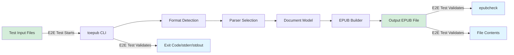
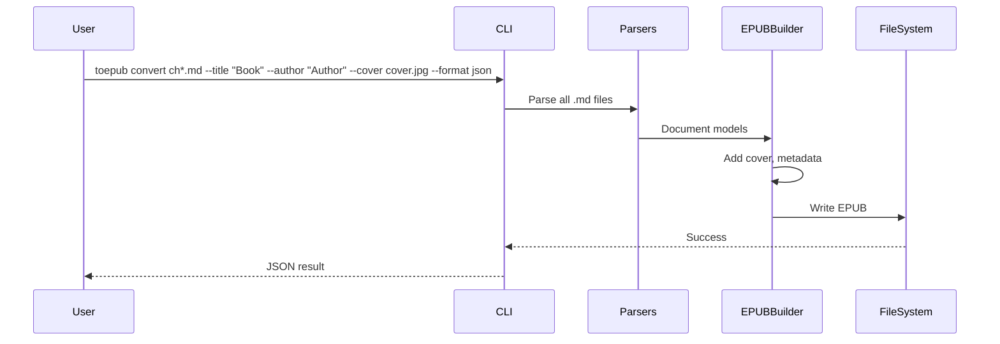

# End-to-End Test Plan: to-epub

**Version**: 1.0 | **Date**: 2025-12-15 | **Status**: Active
**Maintained by**: Development Team | **Last Reviewed**: 2025-12-15

**Note**: This document defines the end-to-end testing strategy, test scenarios, and execution plan for the to-epub CLI converter. It ensures comprehensive coverage of critical user journeys and validates EPUB output compliance.

---

## Document Control

| Version | Date | Author | Changes |
|---------|------|--------|---------|
| 1.0 | 2025-12-15 | Development Team | Initial E2E test plan |
| | | | |

**Related Documents**:

- Architecture: `docs/architecture.md`
- Ground Rules: `memory/ground-rules.md`
- Feature Specifications: `specs/001-epub-converter-cli/spec.md`
- Standards: `docs/standards.md`

---

## Table of Contents

1. [Introduction](#1-introduction)
2. [Test Strategy](#2-test-strategy)
3. [Test Scope](#3-test-scope)
4. [User Journeys](#4-user-journeys)
5. [Test Scenarios](#5-test-scenarios)
6. [Test Data Management](#6-test-data-management)
7. [Test Environments](#7-test-environments)
8. [Test Framework & Tools](#8-test-framework--tools)
9. [Test Architecture](#9-test-architecture)
10. [Execution Plan](#10-execution-plan)
11. [Reporting & Metrics](#11-reporting--metrics)
12. [Maintenance & Improvement](#12-maintenance--improvement)
13. [Appendices](#13-appendices)

---

## 1. Introduction

### 1.1 Purpose

This document establishes the comprehensive end-to-end (E2E) testing strategy for the to-epub CLI tool. E2E tests validate that the entire conversion pipeline works correctly from CLI input through format parsing, document transformation, EPUB generation, and file output.

### 1.2 Goals

- **Validate critical conversion workflows** end-to-end from input file to valid EPUB output
- **Ensure EPUB compliance** with EPUB 3+ standards via epubcheck validation
- **Verify CLI interface** correctness including flags, exit codes, and output formatting
- **Detect integration issues** between parser, converter, and EPUB builder components
- **Provide confidence** for releases through automated regression testing
- **Document expected behavior** through executable specifications

### 1.3 Audience

- Developers implementing and maintaining test automation
- Contributors understanding test coverage requirements
- Maintainers verifying EPUB compliance after changes
- CI/CD Engineers configuring test pipelines

### 1.4 System Overview

**Product Description**: to-epub is a command-line tool that converts Markdown, HTML, and PDF documents into valid EPUB 3+ e-book files.

**Key Components** (from architecture):

- **CLI Layer**: Command handling with cobra, argument parsing, output formatting
- **Converter**: Orchestration pipeline coordinating parsers and builders
- **Parsers**: Markdown (goldmark), HTML (x/net/html), PDF (ledongthuc/pdf)
- **Document Model**: Intermediate representation (Document, Chapter, Resource, TOC)
- **EPUB Builder**: Package generation (content.opf, nav.xhtml, XHTML content, ZIP packaging)
- **Image Processor**: Image embedding and WebP-to-PNG conversion

**Reference Architecture**: See `docs/architecture.md` for detailed system architecture.

### 1.5 Testing Constraints (from Ground Rules)

Per `memory/ground-rules.md`:

1. **EPUB 3+ Compliance**: All generated EPUBs MUST pass epubcheck validation with zero errors
2. **CLI-First Design**: Tests must validate CLI interface, exit codes, stdout/stderr handling
3. **Input Format Fidelity**: Tests must verify semantic preservation from source formats
4. **Test-Driven Quality**: Unit, integration, and contract tests required
5. **Performance Requirements**: Conversions under 10 seconds for typical documents

---

## 2. Test Strategy

### 2.1 Testing Approach

**E2E Test Philosophy**:

E2E tests for to-epub focus on:

- **Full conversion workflows** from input file to validated EPUB output
- **CLI interface correctness** including flags, arguments, exit codes
- **EPUB contract compliance** via epubcheck validation
- **Cross-format consistency** ensuring similar outputs from equivalent inputs
- **E-reader compatibility** verification with major applications
- **NOT unit-level logic** (covered by unit tests in `*_test.go` files)
- **NOT component interfaces** (covered by integration tests)

**Test Pyramid Position**:

```
       /\        <- E2E Tests (Contract: epubcheck, E-reader compatibility)
      /  \       <- Integration Tests (Parser-to-Model, Model-to-EPUB)
     /____\      <- Unit Tests (Individual parsers, builders, utilities)
```

E2E tests are the **smallest layer** but provide **highest confidence** that the complete system produces valid, readable EPUBs.

### 2.2 Testing Types

**Primary E2E Testing**:

- **CLI-driven tests**: Execute `toepub` binary with various inputs and validate outputs
- **EPUB validation tests**: All outputs verified with epubcheck
- **File system validation**: Verify output files, paths, permissions
- **Cross-platform tests**: Ensure binary works on Linux, macOS, Windows

**Supplementary Testing** (within E2E scope):

- **E-reader compatibility**: Verify EPUBs open correctly in Apple Books, Calibre, Kobo
- **Performance tests**: Measure conversion times for various file sizes
- **Error handling tests**: Verify appropriate error messages and exit codes

### 2.3 Test Levels

| Level | Focus | Examples | Execution Frequency |
|-------|-------|----------|---------------------|
| **Smoke Tests** | Critical happy paths | Convert simple MD to EPUB, validate with epubcheck | Every commit |
| **Regression Tests** | Core features | All format conversions, all CLI flags | Daily/nightly |
| **Full Suite** | Comprehensive coverage | All scenarios including edge cases | Weekly/pre-release |
| **Contract Tests** | EPUB compliance | epubcheck validation on all outputs | Every test run |

### 2.4 Entry and Exit Criteria

**Entry Criteria** (when to run E2E tests):

- [ ] Binary builds successfully (`go build ./cmd/toepub`)
- [ ] Unit tests pass (`go test ./...` >= 80% pass rate)
- [ ] epubcheck is available in test environment
- [ ] Test fixtures are present in `tests/fixtures/`

**Exit Criteria** (when E2E test run is complete):

- [ ] Smoke tests pass 100%
- [ ] Regression tests pass >= 95%
- [ ] All generated EPUBs pass epubcheck validation
- [ ] No P0 (critical) failures
- [ ] Test reports generated in `test-results/`

---

## 3. Test Scope

### 3.1 In Scope

**What IS Covered**:

1. **Conversion Workflows**:
   - Markdown to EPUB (GFM support: tables, code blocks, front matter)
   - HTML to EPUB (semantic markup, CSS handling, image embedding)
   - PDF to EPUB (text extraction, chapter detection, image extraction)
   - Multi-file input to single EPUB
   - Directory input processing

2. **EPUB Output Validation**:
   - epubcheck validation (zero errors requirement)
   - TOC generation accuracy
   - Metadata correctness (title, author, language)
   - Image embedding and conversion (WebP to PNG)
   - XHTML content validity

3. **CLI Interface**:
   - Flag parsing (--output, --title, --author, --language, --cover, --format)
   - Help text display (--help, no arguments)
   - Exit code correctness (0 success, non-zero errors)
   - stdout/stderr separation
   - JSON output format

4. **Error Handling**:
   - File not found
   - Invalid format
   - Permission errors
   - Malformed input handling
   - Missing image warnings

### 3.2 Out of Scope

**What IS NOT Covered** (handled by other test types):

1. **Unit-Level Testing**:
   - Individual parser functions
   - EPUB template rendering
   - Utility function correctness
   - -> Covered by **unit tests** (`*_test.go`)

2. **Component Integration**:
   - Parser interface conformance
   - Model transformations
   - -> Covered by **integration tests**

3. **Non-Functional Testing** (separate test suites):
   - Load testing with thousands of files -> **Performance tests**
   - Security vulnerability scanning -> **Security tests**
   - Memory leak detection -> **Profiling tests**

4. **Out of Scope per Ground Rules**:
   - OCR for scanned PDFs (documented limitation)
   - GUI interfaces
   - Cloud deployment

### 3.3 Testing Boundaries



**Test Entry Point**: CLI invocation with input file path(s)
**Test Exit Points**:
- Exit code verification
- stdout/stderr content validation
- Output EPUB file validation (epubcheck, structure, content)

---

## 4. User Journeys

### 4.1 User Personas

| Persona | Role | Primary Goals |
|---------|------|---------------|
| **Technical Writer** | Documentation author | Convert Markdown docs to readable EPUBs |
| **Developer** | Automation engineer | Integrate converter into publishing pipelines |
| **Publisher** | E-book producer | Convert HTML/PDF content to professional EPUBs |
| **Author** | Book writer | Add metadata, cover images, produce final EPUBs |

### 4.2 Critical User Journeys

#### Journey 1: Simple Markdown Conversion - Priority: P0

**Persona**: Technical Writer
**Business Value**: Core functionality - most common use case
**Frequency**: Very high (primary use case)

**Happy Path**:


**Steps**:

1. **Step 1**: User runs `toepub convert document.md`
   - Expected: CLI accepts input, detects Markdown format
2. **Step 2**: Parser extracts content, headings, images
   - Expected: GFM features preserved (tables, code blocks)
3. **Step 3**: EPUB builder generates package
   - Expected: TOC reflects heading hierarchy
4. **Step 4**: Output file written
   - Expected: `document.epub` created in current directory

**Alternative Paths**:

- **Alt 1**: User specifies output path (`--output book.epub`)
- **Alt 2**: User provides metadata (`--title "My Book" --author "Jane Doe"`)

**Failure Scenarios**:

- **Fail 1**: Input file not found -> Exit code 64, error on stderr
- **Fail 2**: Output path not writable -> Exit code 66, error on stderr

---

#### Journey 2: Multi-File Conversion - Priority: P0

**Persona**: Developer
**Business Value**: Enables batch processing and automation
**Frequency**: High (documentation projects, pipelines)

**Happy Path**:


**Steps**:

1. **Step 1**: User runs `toepub convert ch1.md ch2.md ch3.md --output book.epub`
   - Expected: All files accepted
2. **Step 2**: Files processed in alphabetical order
   - Expected: ch1.md, ch2.md, ch3.md order
3. **Step 3**: Each file becomes a chapter
   - Expected: TOC shows all chapters
4. **Step 4**: Single EPUB generated
   - Expected: `book.epub` with all content

**Alternative Paths**:

- **Alt 1**: Directory input (`toepub convert ./chapters/`)

---

#### Journey 3: HTML Conversion with Images - Priority: P1

**Persona**: Publisher
**Business Value**: Convert web content to e-books
**Frequency**: Medium

**Steps**:

1. User runs `toepub convert article.html`
2. HTML parsed, CSS processed
3. Local images embedded in EPUB
4. Remote images downloaded and embedded
5. EPUB generated with styling preserved

---

#### Journey 4: PDF Text Extraction - Priority: P2

**Persona**: Publisher
**Business Value**: Convert existing PDFs to reflowable format
**Frequency**: Lower (complex conversion)

**Steps**:

1. User runs `toepub convert document.pdf`
2. Text extracted with layout awareness
3. Chapter structure detected from headings
4. Images extracted and embedded
5. EPUB generated with navigation

**Failure Scenario**:

- **Fail 1**: Scanned PDF detected -> Exit code 65, error explaining OCR required

---

#### Journey 5: Pipeline Integration (JSON Output) - Priority: P1

**Persona**: Developer
**Business Value**: Enables scripting and automation
**Frequency**: High for automated workflows

**Steps**:

1. User runs `toepub convert doc.md --format json`
2. Conversion proceeds normally
3. Result output as JSON to stdout
4. Exit code indicates success/failure

---

### 4.3 Journey Priority Matrix

| Priority | Definition | Examples | Test Frequency |
|----------|------------|----------|----------------|
| **P0 - Critical** | Core conversion functionality | Markdown/HTML to EPUB, epubcheck validation | Every commit |
| **P1 - High** | Important features | Multi-file, metadata, JSON output, cover image | Daily |
| **P2 - Medium** | Secondary formats | PDF conversion, directory input | Weekly |
| **P3 - Low** | Edge cases, rare scenarios | Very large files, unusual encodings | Pre-release |

---

## 5. Test Scenarios

### 5.1 Scenario Structure

Each test scenario follows this structure:

```
Scenario: [Descriptive name]
  Priority: [P0/P1/P2/P3]
  Tags: [smoke, regression, contract, etc.]

  Given [precondition/setup]
  When [CLI command executed]
  Then [expected result]
  And [additional validation]
```

### 5.2 Critical Scenarios (P0)

#### Scenario 5.2.1: Simple Markdown to EPUB

**Priority**: P0
**Tags**: `smoke`, `markdown`, `contract`, `critical`
**User Journey**: Simple Markdown Conversion
**Estimated Duration**: 5-10 seconds

**Preconditions**:

- `toepub` binary is built and available
- Test fixture `simple.md` exists with headings, paragraphs, lists
- epubcheck is available

**Test Steps**:

```gherkin
Given test fixture "tests/fixtures/markdown/simple.md" exists
And the file contains headings (h1, h2), paragraphs, and a list
When user runs "toepub convert tests/fixtures/markdown/simple.md"
Then exit code is 0
And file "simple.epub" is created in current directory
And the EPUB passes epubcheck validation with zero errors
And the EPUB contains a nav.xhtml with TOC entries matching headings
And the EPUB content.opf contains dc:title derived from first h1
```

**Expected Results**:

- Exit code: 0
- Output file: `simple.epub` (or specified output path)
- epubcheck: PASS with 0 errors
- TOC: Reflects document heading structure
- Content: Preserves Markdown formatting

**Validation Commands**:

```bash
# Run conversion
./toepub convert tests/fixtures/markdown/simple.md

# Verify exit code
echo $?  # Should be 0

# Verify file exists
ls -la simple.epub

# Validate with epubcheck
java -jar epubcheck.jar simple.epub

# Verify TOC structure (unzip and inspect)
unzip -p simple.epub EPUB/nav.xhtml | grep -E '<a href='
```

---

#### Scenario 5.2.2: Markdown with GFM Tables

**Priority**: P0
**Tags**: `smoke`, `markdown`, `gfm`, `contract`

**Preconditions**:

- Test fixture `gfm_tables.md` contains GFM table syntax

**Test Steps**:

```gherkin
Given test fixture "tests/fixtures/markdown/gfm_tables.md" exists
And the file contains a GFM table with header row and data rows
When user runs "toepub convert tests/fixtures/markdown/gfm_tables.md"
Then exit code is 0
And the EPUB passes epubcheck validation
And the EPUB content contains an HTML <table> element
And table headers are in <th> elements
And table data is in <td> elements
```

---

#### Scenario 5.2.3: Markdown with Embedded Images

**Priority**: P0
**Tags**: `smoke`, `markdown`, `images`, `contract`

**Preconditions**:

- Test fixture `with_images.md` references local images
- Image files exist at referenced paths

**Test Steps**:

```gherkin
Given test fixture "tests/fixtures/markdown/with_images.md" exists
And the file references image "images/diagram.png"
And the image file exists at "tests/fixtures/markdown/images/diagram.png"
When user runs "toepub convert tests/fixtures/markdown/with_images.md"
Then exit code is 0
And the EPUB passes epubcheck validation
And the EPUB contains the image file in EPUB/images/ directory
And the EPUB manifest lists the image with correct media-type
And the EPUB content references the image correctly
```

---

#### Scenario 5.2.4: HTML to EPUB Basic Conversion

**Priority**: P0
**Tags**: `smoke`, `html`, `contract`

**Preconditions**:

- Test fixture `simple.html` contains semantic HTML

**Test Steps**:

```gherkin
Given test fixture "tests/fixtures/html/simple.html" exists
And the file contains <h1>, <h2>, <p>, <ul> elements
When user runs "toepub convert tests/fixtures/html/simple.html"
Then exit code is 0
And the EPUB passes epubcheck validation
And the EPUB TOC reflects heading structure
And semantic elements are preserved in XHTML content
```

---

#### Scenario 5.2.5: CLI Help Display

**Priority**: P0
**Tags**: `smoke`, `cli`, `critical`

**Test Steps**:

```gherkin
Given toepub binary is available
When user runs "toepub --help"
Then exit code is 0
And stdout contains "Usage:" section
And stdout contains "convert" command description
And stdout contains available flags (--output, --title, --author, etc.)
And stderr is empty
```

---

#### Scenario 5.2.6: CLI No Arguments Shows Help

**Priority**: P0
**Tags**: `smoke`, `cli`

**Test Steps**:

```gherkin
Given toepub binary is available
When user runs "toepub" with no arguments
Then exit code is 0
And stdout contains usage information
And stdout contains available commands
```

---

#### Scenario 5.2.7: Invalid Input File Error

**Priority**: P0
**Tags**: `smoke`, `error-handling`, `critical`

**Test Steps**:

```gherkin
Given file "nonexistent.md" does not exist
When user runs "toepub convert nonexistent.md"
Then exit code is 64 (file not found)
And stderr contains error message mentioning the file
And stderr contains "not found" or similar message
And stdout is empty
And no EPUB file is created
```

---

### 5.3 High Priority Scenarios (P1)

#### Scenario 5.3.1: Multi-File Markdown Conversion

**Priority**: P1
**Tags**: `regression`, `multi-file`, `markdown`

**Test Steps**:

```gherkin
Given test fixtures "ch01.md", "ch02.md", "ch03.md" exist
When user runs "toepub convert ch01.md ch02.md ch03.md --output book.epub"
Then exit code is 0
And "book.epub" is created
And the EPUB passes epubcheck validation
And the EPUB contains 3 chapters in alphabetical order
And TOC has entries for all chapters
```

---

#### Scenario 5.3.2: Metadata Override via CLI Flags

**Priority**: P1
**Tags**: `regression`, `metadata`, `cli`

**Test Steps**:

```gherkin
Given test fixture "simple.md" exists
When user runs:
  toepub convert simple.md --title "Custom Title" --author "John Doe" --language "en-US"
Then exit code is 0
And the EPUB content.opf contains:
  - dc:title = "Custom Title"
  - dc:creator = "John Doe"
  - dc:language = "en-US"
```

---

#### Scenario 5.3.3: Cover Image Addition

**Priority**: P1
**Tags**: `regression`, `metadata`, `images`

**Test Steps**:

```gherkin
Given test fixture "simple.md" exists
And cover image "cover.jpg" exists
When user runs "toepub convert simple.md --cover cover.jpg"
Then exit code is 0
And the EPUB contains the cover image
And the EPUB manifest includes cover image with properties="cover-image"
And the EPUB spine includes cover page
```

---

#### Scenario 5.3.4: JSON Output Format

**Priority**: P1
**Tags**: `regression`, `cli`, `json`

**Test Steps**:

```gherkin
Given test fixture "simple.md" exists
When user runs "toepub convert simple.md --format json"
Then exit code is 0
And stdout is valid JSON
And JSON contains "success": true
And JSON contains "output" with EPUB file path
And JSON contains "stats" object with conversion statistics
```

---

#### Scenario 5.3.5: JSON Output on Error

**Priority**: P1
**Tags**: `regression`, `cli`, `json`, `error-handling`

**Test Steps**:

```gherkin
Given file "nonexistent.md" does not exist
When user runs "toepub convert nonexistent.md --format json"
Then exit code is non-zero
And stdout is valid JSON
And JSON contains "success": false
And JSON contains "error" object with error details
```

---

#### Scenario 5.3.6: WebP Image Auto-Conversion

**Priority**: P1
**Tags**: `regression`, `images`, `conversion`

**Test Steps**:

```gherkin
Given test fixture "with_webp.md" references a WebP image
And the WebP image file exists
When user runs "toepub convert with_webp.md"
Then exit code is 0
And the EPUB passes epubcheck validation
And the EPUB contains a PNG version of the image (not WebP)
And conversion warning may be present in output
```

---

#### Scenario 5.3.7: Front Matter Metadata Extraction

**Priority**: P1
**Tags**: `regression`, `markdown`, `metadata`

**Test Steps**:

```gherkin
Given test fixture "front_matter.md" contains YAML front matter:
  ---
  title: Front Matter Title
  author: Front Matter Author
  ---
When user runs "toepub convert front_matter.md"
Then exit code is 0
And the EPUB content.opf contains:
  - dc:title = "Front Matter Title"
  - dc:creator = "Front Matter Author"
```

---

#### Scenario 5.3.8: Directory Input Processing

**Priority**: P1
**Tags**: `regression`, `multi-file`, `directory`

**Test Steps**:

```gherkin
Given directory "tests/fixtures/book/" contains:
  - chapter1.md
  - chapter2.md
  - images/diagram.png
When user runs "toepub convert tests/fixtures/book/ --output book.epub"
Then exit code is 0
And "book.epub" is created
And the EPUB passes epubcheck validation
And the EPUB contains both chapters
And images are embedded
```

---

### 5.4 Medium Priority Scenarios (P2)

| Scenario ID | Scenario Name | Tags | Journey |
|-------------|---------------|------|---------|
| 5.4.1 | PDF text extraction basic | `pdf`, `regression` | PDF Conversion |
| 5.4.2 | PDF chapter detection from headings | `pdf`, `regression` | PDF Conversion |
| 5.4.3 | PDF image extraction | `pdf`, `images` | PDF Conversion |
| 5.4.4 | HTML with CSS styles | `html`, `css` | HTML Conversion |
| 5.4.5 | HTML with remote images | `html`, `images`, `network` | HTML Conversion |
| 5.4.6 | Custom output path | `cli`, `regression` | CLI Usage |
| 5.4.7 | Version command | `cli`, `regression` | CLI Usage |

---

### 5.5 Edge Cases & Negative Scenarios

#### Scenario 5.5.1: Unsupported Image Format Warning

**Priority**: P1
**Tags**: `negative`, `images`, `warning`

**Test Steps**:

```gherkin
Given test fixture "unsupported_image.md" references a TIFF image
When user runs "toepub convert unsupported_image.md"
Then exit code is 0 (conversion continues)
And stderr contains warning about unsupported image format
And the EPUB is created without the unsupported image
And the EPUB passes epubcheck validation
```

---

#### Scenario 5.5.2: Missing Image Reference Warning

**Priority**: P1
**Tags**: `negative`, `images`, `warning`

**Test Steps**:

```gherkin
Given test fixture "missing_image.md" references "nonexistent.png"
And the image file does not exist
When user runs "toepub convert missing_image.md"
Then exit code is 0 (conversion continues)
And stderr contains warning about missing image
And the EPUB is created without the missing image
And the EPUB passes epubcheck validation
```

---

#### Scenario 5.5.3: Scanned PDF Error

**Priority**: P2
**Tags**: `negative`, `pdf`, `error-handling`

**Test Steps**:

```gherkin
Given test fixture "scanned.pdf" is an image-based PDF
When user runs "toepub convert scanned.pdf"
Then exit code is 65 (format error)
And stderr contains error message about OCR being required
And no EPUB file is created
```

---

#### Scenario 5.5.4: Output Path Not Writable

**Priority**: P1
**Tags**: `negative`, `error-handling`

**Test Steps**:

```gherkin
Given test fixture "simple.md" exists
And directory "/readonly" exists but is not writable
When user runs "toepub convert simple.md --output /readonly/book.epub"
Then exit code is 66 (not writable)
And stderr contains error about permission or write access
```

---

#### Scenario 5.5.5: Invalid Format Detection Override

**Priority**: P2
**Tags**: `negative`, `cli`, `error-handling`

**Test Steps**:

```gherkin
Given test fixture "simple.md" exists
When user runs "toepub convert simple.md --format-input pdf"
Then exit code is 65 (format error)
And stderr contains error about format mismatch or parse failure
```

---

#### Scenario 5.5.6: Empty Input File

**Priority**: P2
**Tags**: `negative`, `edge-case`

**Test Steps**:

```gherkin
Given test fixture "empty.md" exists but is empty (0 bytes)
When user runs "toepub convert empty.md"
Then exit code is 0 or specific error code
And if EPUB is created, it passes epubcheck validation
```

---

### 5.6 Cross-Feature Integration Scenarios

#### Scenario 5.6.1: Full Publishing Workflow

**Priority**: P1
**Tags**: `integration`, `workflow`, `critical`
**Features Involved**: Multi-file, Metadata, Cover Image, JSON Output

**Workflow**:



**Test Steps**:

```gherkin
Given test fixtures "ch01.md", "ch02.md", "ch03.md" exist
And cover image "cover.jpg" exists
When user runs:
  toepub convert ch*.md \
    --title "Integration Test Book" \
    --author "Test Author" \
    --cover cover.jpg \
    --output test-book.epub \
    --format json
Then exit code is 0
And stdout is valid JSON with success=true
And "test-book.epub" is created
And the EPUB passes epubcheck validation
And the EPUB contains 3 chapters
And the EPUB has cover image
And metadata shows custom title and author
```

---

#### Scenario 5.6.2: Mixed Format Conversion

**Priority**: P2
**Tags**: `integration`, `multi-format`

**Test Steps**:

```gherkin
Given test fixtures "intro.md" and "chapter.html" exist
When user runs "toepub convert intro.md chapter.html --output mixed.epub"
Then exit code is 0
And "mixed.epub" passes epubcheck validation
And the EPUB contains content from both files
```

---

## 6. Test Data Management

### 6.1 Test Data Strategy

**Approach**: Fixed fixtures with deterministic content

**Principles**:

- **Isolation**: Each test uses specific fixtures, no shared mutable state
- **Repeatability**: Tests produce identical results with same fixtures
- **Version Control**: All fixtures committed to repository
- **Minimal Size**: Fixtures are small but representative
- **Format Coverage**: Fixtures cover all supported input formats

### 6.2 Test Data Types

| Data Type | Source | Storage | Lifecycle |
|-----------|--------|---------|-----------|
| **Markdown Fixtures** | Hand-crafted | `tests/fixtures/markdown/` | Permanent, version controlled |
| **HTML Fixtures** | Hand-crafted | `tests/fixtures/html/` | Permanent, version controlled |
| **PDF Fixtures** | Generated | `tests/fixtures/pdf/` | Permanent, version controlled |
| **Image Fixtures** | Sample images | `tests/fixtures/images/` | Permanent, version controlled |
| **Expected Outputs** | Generated/verified | `tests/golden/` | Updated when intentionally changed |

### 6.3 Test Fixture Catalog

#### Markdown Fixtures (`tests/fixtures/markdown/`)

| Fixture | Description | Tests |
|---------|-------------|-------|
| `simple.md` | Basic headings, paragraphs, lists | Basic conversion |
| `gfm_tables.md` | GFM table syntax | Table rendering |
| `code_blocks.md` | Fenced and indented code | Code formatting |
| `front_matter.md` | YAML front matter metadata | Metadata extraction |
| `with_images.md` | Embedded image references | Image handling |
| `with_webp.md` | WebP image reference | Format conversion |
| `missing_image.md` | References non-existent image | Warning handling |
| `unicode.md` | Non-ASCII characters, emoji | Encoding handling |
| `large.md` | 50+ pages of content | Performance test |
| `empty.md` | Empty file | Edge case |

#### HTML Fixtures (`tests/fixtures/html/`)

| Fixture | Description | Tests |
|---------|-------------|-------|
| `simple.html` | Semantic HTML5 | Basic conversion |
| `with_css.html` | Inline and linked CSS | Style handling |
| `with_images.html` | Local image references | Image embedding |
| `remote_images.html` | Remote URL images | Download handling |
| `complex.html` | Full webpage structure | Complex conversion |

#### PDF Fixtures (`tests/fixtures/pdf/`)

| Fixture | Description | Tests |
|---------|-------------|-------|
| `simple.pdf` | Text-based, clear structure | Basic extraction |
| `with_images.pdf` | Embedded images | Image extraction |
| `scanned.pdf` | Image-based (scanned) | Error handling |
| `large.pdf` | 50+ pages | Performance test |

### 6.4 Golden Files

Golden files store expected output for comparison:

```
tests/golden/
├── markdown/
│   ├── simple_nav.xhtml      # Expected navigation
│   ├── simple_content.xhtml  # Expected content
│   └── simple_opf.xml        # Expected package doc
├── html/
│   └── ...
└── pdf/
    └── ...
```

**Golden File Update Process**:

1. Run tests with `--update-golden` flag
2. Review changes in diff
3. Commit updated golden files with explanation

### 6.5 Test Data Cleanup

**Cleanup Strategy**:

- Output files created in temp directories
- Temp directories deleted after test completion
- Use `t.TempDir()` in Go tests for automatic cleanup

```go
func TestConversion(t *testing.T) {
    // Create temp dir that's auto-cleaned after test
    outputDir := t.TempDir()
    outputPath := filepath.Join(outputDir, "output.epub")

    // Run conversion
    err := runToepub("convert", "fixtures/simple.md", "--output", outputPath)

    // Validate (temp dir cleaned up automatically)
}
```

---

## 7. Test Environments

### 7.1 Environment Configurations

| Environment | Purpose | Platform | Dependencies |
|-------------|---------|----------|--------------|
| **Local** | Development testing | Developer machine | Go 1.24+, epubcheck |
| **CI (Linux)** | Automated testing | Ubuntu latest | Go 1.24+, epubcheck, Java |
| **CI (macOS)** | Cross-platform | macOS latest | Go 1.24+, epubcheck, Java |
| **CI (Windows)** | Cross-platform | Windows latest | Go 1.24+, epubcheck, Java |

### 7.2 Environment Setup

**Local Development**:

```bash
# Install Go 1.24+
go version  # Verify: go1.24+

# Install epubcheck (requires Java)
# macOS:
brew install epubcheck

# Linux:
wget https://github.com/w3c/epubcheck/releases/download/v5.1.0/epubcheck-5.1.0.zip
unzip epubcheck-5.1.0.zip

# Verify
java -jar epubcheck-5.1.0/epubcheck.jar --version

# Build toepub
go build -o toepub ./cmd/toepub

# Run tests
go test ./...
./scripts/e2e-test.sh  # E2E test runner
```

**CI Environment (GitHub Actions)**:

```yaml
name: E2E Tests

on: [push, pull_request]

jobs:
  e2e:
    strategy:
      matrix:
        os: [ubuntu-latest, macos-latest, windows-latest]
    runs-on: ${{ matrix.os }}
    steps:
      - uses: actions/checkout@v4
      - uses: actions/setup-go@v5
        with:
          go-version: '1.24'
      - uses: actions/setup-java@v4
        with:
          distribution: 'temurin'
          java-version: '17'
      - name: Install epubcheck
        run: |
          curl -LO https://github.com/w3c/epubcheck/releases/download/v5.1.0/epubcheck-5.1.0.zip
          unzip epubcheck-5.1.0.zip
      - name: Build
        run: go build -o toepub ./cmd/toepub
      - name: Run E2E tests
        run: go test -tags=e2e ./tests/e2e/...
```

### 7.3 External Dependencies

**Required**:

- **epubcheck**: W3C EPUB validation tool (Java-based)
  - Version: 5.1.0+
  - Purpose: Contract validation of all generated EPUBs

**Optional (for compatibility testing)**:

- **Calibre**: E-reader application for manual validation
- **Apple Books**: macOS e-reader (manual testing)

### 7.4 Infrastructure Requirements

**Compute**:

- CPU: 2+ cores recommended for parallel test execution
- Memory: 4GB RAM minimum
- Storage: 1GB for test fixtures and outputs

**Software**:

- Go 1.24+
- Java 17+ (for epubcheck)
- Git

---

## 8. Test Framework & Tools

### 8.1 Framework Selection

**Primary Testing Framework**: Go testing package + testify

**Justification**:

- Native Go testing aligns with project language
- testify provides expressive assertions
- No additional framework dependencies
- Integrates seamlessly with `go test`
- Parallel test execution built-in

### 8.2 Tool Stack

| Category | Tool | Purpose | Version |
|----------|------|---------|---------|
| **Test Framework** | Go testing | Test execution | Go 1.24+ |
| **Assertions** | testify | Expressive assertions | Latest |
| **EPUB Validation** | epubcheck | Contract validation | 5.1.0+ |
| **Shell Testing** | bash scripts | CLI invocation | - |
| **Coverage** | go test -cover | Code coverage | Built-in |
| **CI/CD** | GitHub Actions | Automation | - |
| **Reporting** | go-junit-report | JUnit XML output | Latest |

### 8.3 Test Runner Configuration

**Go Test Configuration** (`go.mod` test dependencies):

```go
require (
    github.com/stretchr/testify v1.9.0
)
```

**Test Tags**:

Use build tags to separate test types:

```go
//go:build e2e
// +build e2e

package e2e

func TestMarkdownConversion(t *testing.T) {
    // E2E test implementation
}
```

**Running Tests**:

```bash
# Unit tests only
go test ./...

# E2E tests only
go test -tags=e2e ./tests/e2e/...

# All tests
go test -tags=e2e ./...

# Specific test
go test -tags=e2e -run TestMarkdownConversion ./tests/e2e/...

# With coverage
go test -tags=e2e -coverprofile=coverage.out ./...
```

### 8.4 Custom Utilities

**E2E Test Helpers** (`tests/e2e/helpers/`):

```go
// tests/e2e/helpers/runner.go
package helpers

import (
    "os/exec"
    "path/filepath"
    "testing"
)

// RunToepub executes the toepub binary with given arguments
func RunToepub(t *testing.T, args ...string) *Result {
    t.Helper()

    binary := filepath.Join(binDir(), "toepub")
    cmd := exec.Command(binary, args...)

    // Capture stdout, stderr
    // Return Result with exit code, output, error
}

// ValidateEPUB runs epubcheck on the given EPUB file
func ValidateEPUB(t *testing.T, epubPath string) *ValidationResult {
    t.Helper()

    cmd := exec.Command("java", "-jar", epubcheckPath(), epubPath)
    // Parse and return validation results
}

// AssertEPUBValid asserts that the EPUB passes epubcheck
func AssertEPUBValid(t *testing.T, epubPath string) {
    t.Helper()

    result := ValidateEPUB(t, epubPath)
    if !result.Valid {
        t.Errorf("EPUB validation failed: %v", result.Errors)
    }
}
```

---

## 9. Test Architecture

### 9.1 Design Pattern

**Pattern**: Helper-based test organization (Go idiomatic)

**Structure**:

```
tests/
├── e2e/
│   ├── helpers/              # Test utilities
│   │   ├── runner.go         # CLI execution helper
│   │   ├── validation.go     # EPUB validation
│   │   ├── fixtures.go       # Fixture loading
│   │   └── assertions.go     # Custom assertions
│   ├── markdown_test.go      # Markdown conversion tests
│   ├── html_test.go          # HTML conversion tests
│   ├── pdf_test.go           # PDF conversion tests
│   ├── cli_test.go           # CLI interface tests
│   ├── metadata_test.go      # Metadata tests
│   └── integration_test.go   # Cross-feature tests
├── fixtures/                 # Test input files
│   ├── markdown/
│   ├── html/
│   ├── pdf/
│   └── images/
└── golden/                   # Expected outputs
    ├── markdown/
    └── html/
```

### 9.2 Test Helper Examples

**CLI Runner Helper**:

```go
// tests/e2e/helpers/runner.go
package helpers

import (
    "bytes"
    "os/exec"
    "testing"
)

type Result struct {
    ExitCode int
    Stdout   string
    Stderr   string
}

func RunToepub(t *testing.T, args ...string) *Result {
    t.Helper()

    cmd := exec.Command("./toepub", args...)
    var stdout, stderr bytes.Buffer
    cmd.Stdout = &stdout
    cmd.Stderr = &stderr

    err := cmd.Run()
    exitCode := 0
    if exitErr, ok := err.(*exec.ExitError); ok {
        exitCode = exitErr.ExitCode()
    }

    return &Result{
        ExitCode: exitCode,
        Stdout:   stdout.String(),
        Stderr:   stderr.String(),
    }
}
```

**EPUB Validation Helper**:

```go
// tests/e2e/helpers/validation.go
package helpers

import (
    "os/exec"
    "strings"
    "testing"
)

func AssertEPUBValid(t *testing.T, epubPath string) {
    t.Helper()

    cmd := exec.Command("java", "-jar", "epubcheck.jar", epubPath)
    output, err := cmd.CombinedOutput()

    if err != nil {
        t.Errorf("epubcheck failed: %s\n%s", err, output)
    }

    if strings.Contains(string(output), "ERROR") {
        t.Errorf("EPUB validation errors:\n%s", output)
    }
}
```

### 9.3 Test Structure

**AAA Pattern** (Arrange-Act-Assert):

```go
func TestMarkdownSimpleConversion(t *testing.T) {
    // ARRANGE - Setup
    inputPath := filepath.Join("fixtures", "markdown", "simple.md")
    outputDir := t.TempDir()
    outputPath := filepath.Join(outputDir, "output.epub")

    // ACT - Execute
    result := helpers.RunToepub(t, "convert", inputPath, "--output", outputPath)

    // ASSERT - Verify
    assert.Equal(t, 0, result.ExitCode, "Exit code should be 0")
    assert.FileExists(t, outputPath, "EPUB should be created")
    helpers.AssertEPUBValid(t, outputPath)

    // Additional content assertions
    epub := helpers.OpenEPUB(t, outputPath)
    assert.Contains(t, epub.TOC, "Introduction", "TOC should contain heading")
}
```

### 9.4 Test Organization

**Naming Conventions**:

- Test files: `*_test.go` with `e2e` build tag
- Test functions: `Test{Feature}_{Scenario}`
- Helpers: Exported functions in `helpers/` package

**Test Tags**:

```go
//go:build e2e

package e2e

func TestMarkdown_SimpleConversion(t *testing.T) { }
func TestMarkdown_GFMTables(t *testing.T) { }
func TestMarkdown_WithImages(t *testing.T) { }
func TestCLI_HelpDisplay(t *testing.T) { }
func TestCLI_InvalidInput(t *testing.T) { }
```

**Parallel Execution**:

```go
func TestMarkdownSuite(t *testing.T) {
    t.Parallel()  // Run test suite in parallel

    t.Run("SimpleConversion", func(t *testing.T) {
        t.Parallel()  // Run subtests in parallel
        // test implementation
    })

    t.Run("GFMTables", func(t *testing.T) {
        t.Parallel()
        // test implementation
    })
}
```

---

## 10. Execution Plan

### 10.1 Test Suites

| Suite | Purpose | Scenarios | Duration | Frequency |
|-------|---------|-----------|----------|-----------|
| **Smoke** | Critical paths + epubcheck | P0 scenarios | ~2 min | Every commit |
| **Regression** | All features | P0 + P1 scenarios | ~10 min | Daily/nightly |
| **Full** | Comprehensive | All scenarios | ~30 min | Weekly |
| **Contract** | EPUB compliance | All outputs validated | Included in all | Every test run |

### 10.2 Execution Commands

```bash
# Smoke tests (every commit)
go test -tags=e2e -run "Test.*Smoke" ./tests/e2e/... -v

# Regression tests (daily)
go test -tags=e2e ./tests/e2e/... -v

# Full suite with coverage
go test -tags=e2e -coverprofile=coverage.out ./tests/e2e/... -v

# Specific test
go test -tags=e2e -run TestMarkdown_SimpleConversion ./tests/e2e/... -v

# Cross-platform (in CI)
GOOS=linux go test -tags=e2e ./tests/e2e/...
GOOS=darwin go test -tags=e2e ./tests/e2e/...
GOOS=windows go test -tags=e2e ./tests/e2e/...
```

### 10.3 CI/CD Integration

**GitHub Actions Workflow**:

```yaml
name: E2E Tests

on:
  push:
    branches: [main, develop]
  pull_request:
    branches: [main]
  schedule:
    - cron: '0 2 * * *'  # Daily at 2 AM UTC

jobs:
  e2e-smoke:
    runs-on: ubuntu-latest
    steps:
      - uses: actions/checkout@v4
      - uses: actions/setup-go@v5
        with:
          go-version: '1.24'
      - uses: actions/setup-java@v4
        with:
          distribution: 'temurin'
          java-version: '17'
      - name: Install epubcheck
        run: |
          curl -LO https://github.com/w3c/epubcheck/releases/download/v5.1.0/epubcheck-5.1.0.zip
          unzip epubcheck-5.1.0.zip
          echo "EPUBCHECK_JAR=$(pwd)/epubcheck-5.1.0/epubcheck.jar" >> $GITHUB_ENV
      - name: Build binary
        run: go build -o toepub ./cmd/toepub
      - name: Run smoke tests
        run: go test -tags=e2e -run "Test.*" ./tests/e2e/... -v
      - name: Upload test results
        uses: actions/upload-artifact@v4
        if: always()
        with:
          name: test-results-${{ matrix.os }}
          path: test-results/

  e2e-cross-platform:
    strategy:
      matrix:
        os: [ubuntu-latest, macos-latest, windows-latest]
    runs-on: ${{ matrix.os }}
    if: github.event_name == 'schedule' || github.ref == 'refs/heads/main'
    steps:
      - uses: actions/checkout@v4
      - uses: actions/setup-go@v5
        with:
          go-version: '1.24'
      - uses: actions/setup-java@v4
        with:
          distribution: 'temurin'
          java-version: '17'
      - name: Install epubcheck
        run: |
          curl -LO https://github.com/w3c/epubcheck/releases/download/v5.1.0/epubcheck-5.1.0.zip
          unzip epubcheck-5.1.0.zip
      - name: Build and test
        run: |
          go build -o toepub ./cmd/toepub
          go test -tags=e2e ./tests/e2e/... -v
```

### 10.4 Parallel Execution

**Strategy**: Use Go's built-in parallel test execution

**Configuration**:

```bash
# Run with specific parallelism
go test -tags=e2e -parallel 4 ./tests/e2e/...

# Default: GOMAXPROCS (number of CPUs)
go test -tags=e2e ./tests/e2e/...
```

### 10.5 Execution Triggers

| Trigger | Suite | Condition |
|---------|-------|-----------|
| **Git Push** | Smoke | Every push to main/develop |
| **Pull Request** | Smoke | PR opened/updated |
| **Scheduled** | Full | Daily at 2 AM UTC |
| **Manual** | Full | On-demand via workflow_dispatch |
| **Release Tag** | Full + Cross-platform | Tag created |

---

## 11. Reporting & Metrics

### 11.1 Test Reports

**Report Types**:

- **Console Output**: Default go test output with `-v` flag
- **JSON Output**: `go test -json` for parsing
- **JUnit XML**: For CI integration via go-junit-report
- **Coverage Report**: HTML coverage via `go tool cover`

**Report Generation**:

```bash
# Generate JUnit XML report
go test -tags=e2e ./tests/e2e/... -v 2>&1 | go-junit-report > test-results.xml

# Generate coverage report
go test -tags=e2e -coverprofile=coverage.out ./...
go tool cover -html=coverage.out -o coverage.html
```

### 11.2 Test Results Dashboard

**GitHub Actions Summary** (in workflow):

```yaml
- name: Test Summary
  if: always()
  run: |
    echo "## E2E Test Results" >> $GITHUB_STEP_SUMMARY
    echo "" >> $GITHUB_STEP_SUMMARY
    echo "| Metric | Value |" >> $GITHUB_STEP_SUMMARY
    echo "|--------|-------|" >> $GITHUB_STEP_SUMMARY
    echo "| Total Tests | $(grep -c 'RUN' test-output.txt) |" >> $GITHUB_STEP_SUMMARY
    echo "| Passed | $(grep -c 'PASS' test-output.txt) |" >> $GITHUB_STEP_SUMMARY
    echo "| Failed | $(grep -c 'FAIL' test-output.txt) |" >> $GITHUB_STEP_SUMMARY
```

### 11.3 Failure Notifications

**GitHub Actions Notifications**:

- PR check status: Automatic via GitHub
- Failed workflow: Configure GitHub notifications

**Notification Rules**:

- **Smoke failures**: Block PR merge
- **Regression failures**: Alert on nightly run
- **Contract failures**: Immediate investigation (EPUB compliance)

### 11.4 Key Metrics

| Metric | Definition | Target |
|--------|------------|--------|
| **Pass Rate** | (Passed / Total) x 100 | >= 95% |
| **EPUB Compliance** | EPUBs passing epubcheck | 100% |
| **Execution Time** | Full suite duration | <= 30 min |
| **Coverage** | Code coverage percentage | >= 80% |
| **Flaky Rate** | Intermittent failures | <= 2% |

---

## 12. Maintenance & Improvement

### 12.1 Flaky Test Management

**Definition**: A flaky test passes and fails intermittently without code changes.

**Prevention**:

- Use `t.TempDir()` for isolated output directories
- Avoid time-dependent assertions
- Don't rely on file system ordering

**Resolution**:

1. Identify flaky test from CI history
2. Add debug logging to isolate cause
3. Fix root cause (usually race condition or timing)
4. If can't fix immediately, mark with `t.Skip("Flaky: ISSUE-123")`

### 12.2 Test Maintenance Schedule

| Task | Frequency | Owner |
|------|-----------|-------|
| Review flaky tests | Weekly | Dev Team |
| Update test fixtures | As needed | Dev Team |
| Review coverage gaps | Monthly | Dev Team |
| Update epubcheck version | Quarterly | Maintainer |
| Archive obsolete tests | Quarterly | Maintainer |

### 12.3 Adding New Tests

**Process for New Features**:

1. Add test fixture(s) to `tests/fixtures/`
2. Write E2E test in appropriate `*_test.go` file
3. Include epubcheck validation
4. Add to appropriate test suite (smoke/regression)
5. Update this document if new scenario category

**Test Template**:

```go
func TestFeature_Scenario(t *testing.T) {
    // Skip if not E2E run
    if testing.Short() {
        t.Skip("Skipping E2E test in short mode")
    }

    // ARRANGE
    inputPath := filepath.Join("fixtures", "category", "fixture.md")
    outputDir := t.TempDir()
    outputPath := filepath.Join(outputDir, "output.epub")

    // ACT
    result := helpers.RunToepub(t, "convert", inputPath, "--output", outputPath)

    // ASSERT - Exit code
    assert.Equal(t, 0, result.ExitCode)

    // ASSERT - File created
    assert.FileExists(t, outputPath)

    // ASSERT - EPUB valid (CONTRACT)
    helpers.AssertEPUBValid(t, outputPath)

    // ASSERT - Content correct
    // ... additional assertions
}
```

### 12.4 Continuous Improvement

**Review Process**:

1. **Weekly**: Review failed tests in CI
2. **Monthly**: Analyze coverage and add missing tests
3. **Quarterly**: Evaluate test performance and refactor

**Improvement Areas**:

- Add visual diff for EPUB content comparison
- Implement E-reader compatibility automation (Calibre)
- Add performance benchmarking tests
- Expand PDF conversion coverage

---

## 13. Appendices

### 13.1 Glossary

| Term | Definition |
|------|------------|
| **E2E Test** | End-to-end test validating entire conversion workflow |
| **epubcheck** | W3C tool for validating EPUB compliance |
| **Contract Test** | Test verifying output meets specification (EPUB 3+) |
| **Golden File** | Expected output file for comparison |
| **Smoke Test** | Quick test of critical functionality |
| **GFM** | GitHub Flavored Markdown |

### 13.2 Exit Codes Reference

| Code | Constant | Meaning |
|------|----------|---------|
| 0 | ExitSuccess | Success |
| 1 | ExitGeneralError | General error |
| 2 | ExitInvalidArgs | Invalid arguments |
| 64 | ExitFileNotFound | Input file not found |
| 65 | ExitFormatError | Format error |
| 66 | ExitNotWritable | Output not writable |
| 70 | ExitInternalError | Internal error |

### 13.3 References

- **Architecture**: `docs/architecture.md`
- **Standards**: `docs/standards.md`
- **Ground Rules**: `memory/ground-rules.md`
- **Feature Spec**: `specs/001-epub-converter-cli/spec.md`
- **epubcheck Documentation**: https://www.w3.org/publishing/epubcheck/
- **EPUB 3.3 Specification**: https://www.w3.org/TR/epub-33/
- **Go Testing Documentation**: https://golang.org/pkg/testing/

### 13.4 Test Scenario Catalog

**Complete Scenario List by Priority**:

| ID | Priority | Scenario | Tags |
|----|----------|----------|------|
| 5.2.1 | P0 | Simple Markdown to EPUB | smoke, markdown, contract |
| 5.2.2 | P0 | Markdown with GFM Tables | smoke, markdown, gfm |
| 5.2.3 | P0 | Markdown with Images | smoke, markdown, images |
| 5.2.4 | P0 | HTML to EPUB Basic | smoke, html, contract |
| 5.2.5 | P0 | CLI Help Display | smoke, cli |
| 5.2.6 | P0 | CLI No Arguments | smoke, cli |
| 5.2.7 | P0 | Invalid Input Error | smoke, error-handling |
| 5.3.1 | P1 | Multi-File Conversion | regression, multi-file |
| 5.3.2 | P1 | Metadata Override | regression, metadata |
| 5.3.3 | P1 | Cover Image | regression, images |
| 5.3.4 | P1 | JSON Output | regression, cli, json |
| 5.3.5 | P1 | JSON Error Output | regression, cli, json |
| 5.3.6 | P1 | WebP Conversion | regression, images |
| 5.3.7 | P1 | Front Matter Metadata | regression, markdown |
| 5.3.8 | P1 | Directory Input | regression, multi-file |
| 5.4.1 | P2 | PDF Basic Extraction | pdf, regression |
| 5.4.2 | P2 | PDF Chapter Detection | pdf, regression |
| 5.5.1 | P1 | Unsupported Image Warning | negative, images |
| 5.5.2 | P1 | Missing Image Warning | negative, images |
| 5.5.3 | P2 | Scanned PDF Error | negative, pdf |
| 5.5.4 | P1 | Output Not Writable | negative, error-handling |
| 5.6.1 | P1 | Full Publishing Workflow | integration, workflow |
| 5.6.2 | P2 | Mixed Format Conversion | integration, multi-format |

### 13.5 Contact Information

| Role | Contact |
|------|---------|
| **Maintainer** | See repository CODEOWNERS |
| **Issues** | GitHub Issues |
| **Documentation** | See `docs/` directory |

---

**END OF E2E TEST PLAN DOCUMENT**

---

## Maintenance Notes

This document should be:

- **Reviewed monthly** during development
- **Updated** when new features are added
- **Referenced** when implementing new E2E tests
- **Version controlled** alongside test code

For questions or suggestions, open an issue in the repository.
